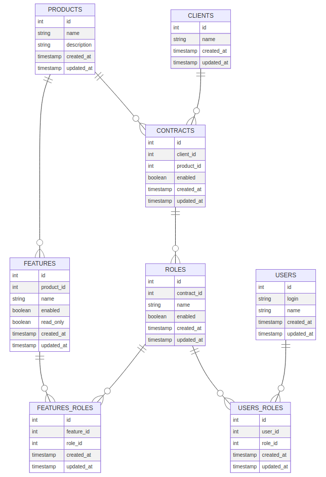

# Entity Documentation

## Entities

Entity |Description
:-------|:-----------
**Clients**|The Clients entity represents a client which can contract a product. Client name is an unique attribute, therefore it is possible to reference to a client uniquely by its name.
**Products**|The Products entity represents a digital product or service which can be to offer ro one or more clients. Product name is an unique attribute, therefore it is possible to reference to a product uniquely by its name.
**Contracts**|The Contracts entity represents business relation between Clients and Products, like a signature. Each contract is associated to many user roles, which has access to this contract.
**Features**|The Features entity represents each all product's functionalities. Functionality can have many interpretations: a system module, a little system function, a system task, and so on. So, use them as you prefer. Feature name is unique by a product.
**Users**|The Users entity represents system users who requires grant access to use product's features (or funcionalities). Login attribute is unique.
**Roles**|The Roles entity represents roles that users can operate. Some people like to refer them like a definition of a users group. Role name is unique by a contract.
**Features_Roles**|The Features_Roles join roles to features. It shows us which are roles have access to which features. The feature-role pair is an unique pair.
**Users_Roles**|The Users_roles join users to roles. It shows us which are users have which roles. The user-role pair is an unique pair.

## Entity Relationship Diagram (ERD)

##### Diagram built with Mermaid library
- [A basic mermaid User-Guide for Beginners](https://mermaid-js.github.io/mermaid/#/n00b-gettingStarted)
- [Entity Relationship Diagrams](https://mermaid-js.github.io/mermaid/#/entityRelationshipDiagram?id=entity-relationship-diagrams)
